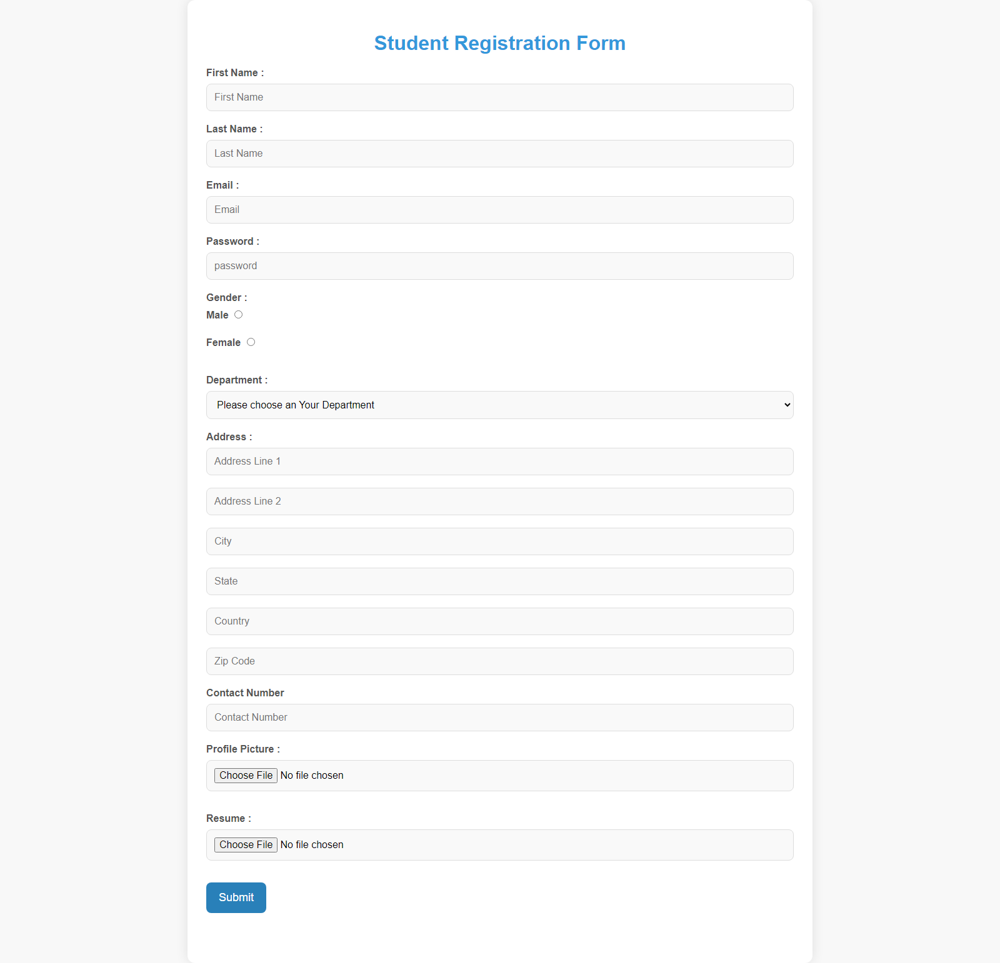
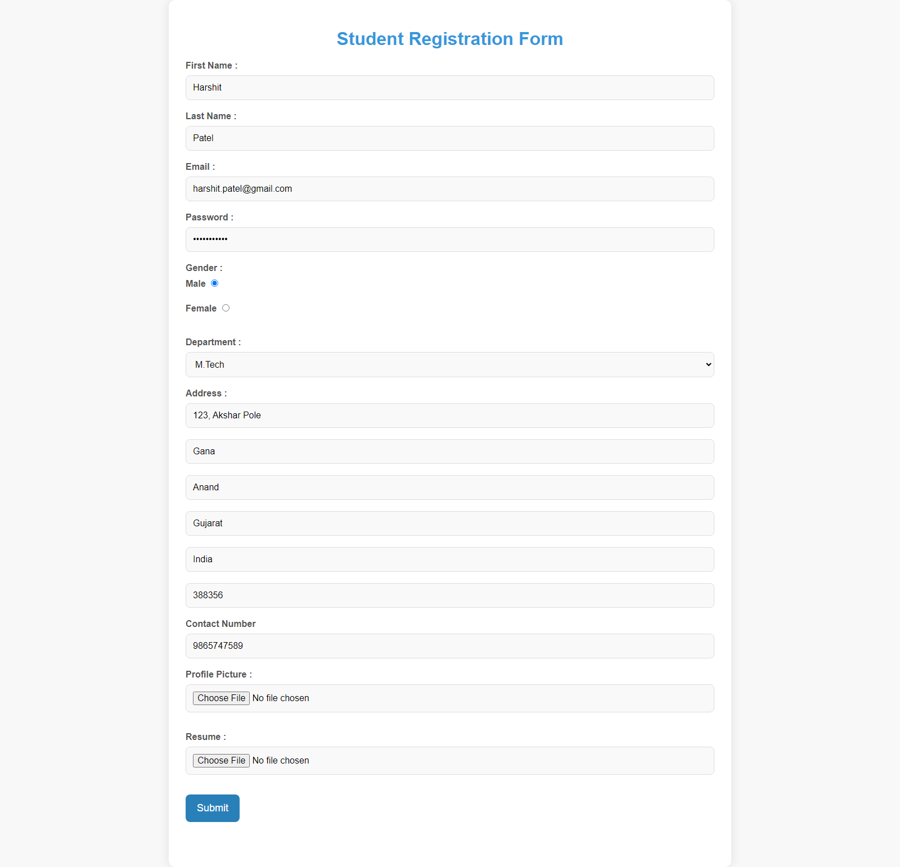
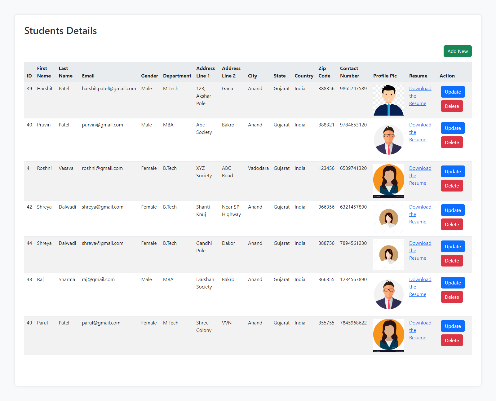
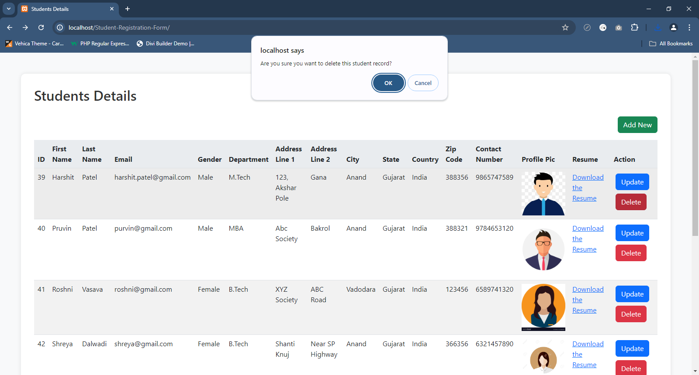

# Student Registration Form

This project is a student registration system built using jQuery Validator, HTML, CSS, and Bootstrap. It allows students to register, update their information, and delete their profiles. The system also supports listing all registered students and includes a resume upload feature.

## **Features**

- **Student Registration**: Register new students with their personal details and resume.
- **Student Update**: Update existing student information.
- **Student Deletion**: Delete student profiles from the system.
- **Student List**: View a list of all registered students.
- **Form Validation**: Utilizes jQuery Validator for client-side form validation.
- **Responsive Design**: Built with Bootstrap for a responsive and mobile-friendly design.

## **Screenshots**

### Student Registration

### Student Update

### Student List

### Student Delete

## **Folder Structure**

- **css/**: Contains custom CSS files for styling the form.
  - **`styles.css`**: Main CSS file for custom styles.

- **documents/**: Contains resumes uploaded by students.
  - **`resume.pdf`**: Example resume file uploaded by a student.

- **images/**: Contains profile pictures of students.
  - **`profile1.jpg`**: Example profile picture of a student.

- **jquery-validation-1.19.5/**: Contains the jQuery Validation plugin files.
  - **`jquery.validate.min.js`**: Minified version of the jQuery Validation plugin.

- **jquery/**: Contains the jQuery library files.
  - **`jquery.min.js`**: Minified version of the jQuery library.

- **js/**: Contains custom JavaScript files.
  - **`script.js`**: Custom JavaScript file for handling form actions.

- **connection.php**: PHP script for establishing a connection to the MySQL database.

- **index.php**: The main page of the student registration system.

- **student.sql**: SQL file for setting up the database schema for the student registration system.

- **student_registration.php**: PHP script for handling student registration, updates, and deletions.

## **How It Works**

1. **Student Registration**:
   - Students can register by filling out the form on `index.php`.
   - The `student_registration.php` script processes the registration form data, saves student information to the database, and uploads the resume.

2. **Student Update**:
   - Students can update their information through the update form.
   - The `student_registration.php` script handles the update process.

3. **Student Deletion**:
   - Students can be deleted from the system.
   - The deletion process is managed by `student_registration.php`.

4. **Student List**:
   - A list of all registered students is displayed on the main page (`index.php`).

5. **Database Schema**:
   - Use the `student.sql` file to create the necessary database tables and structure.

